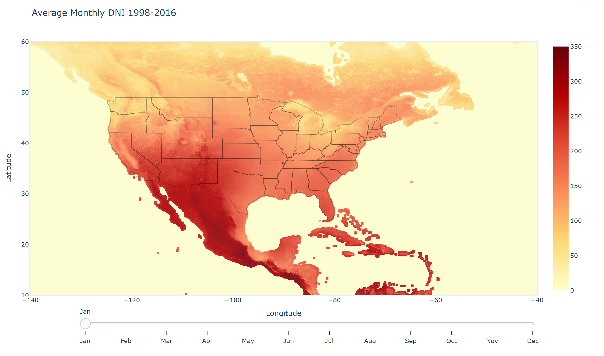
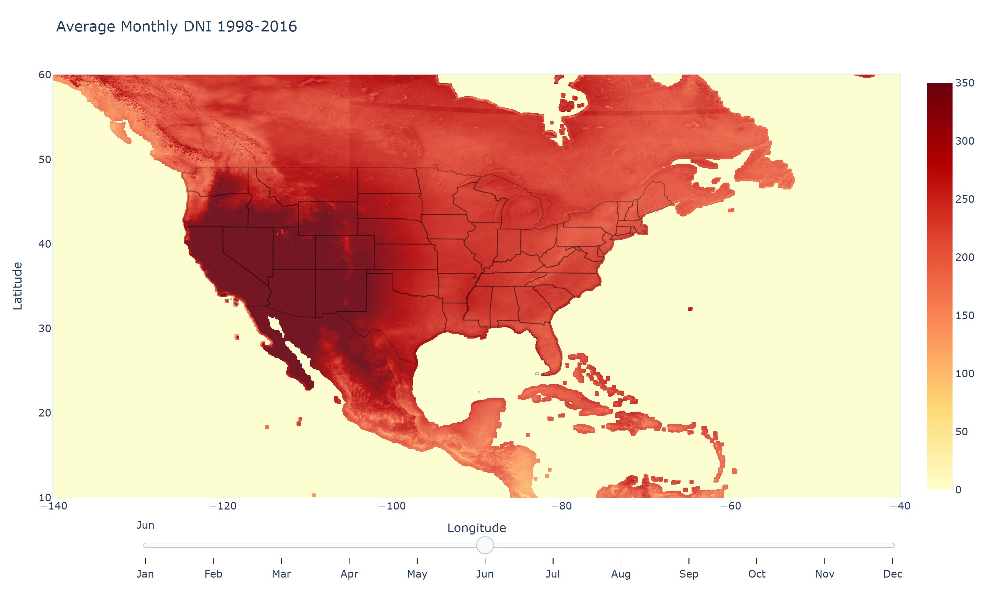
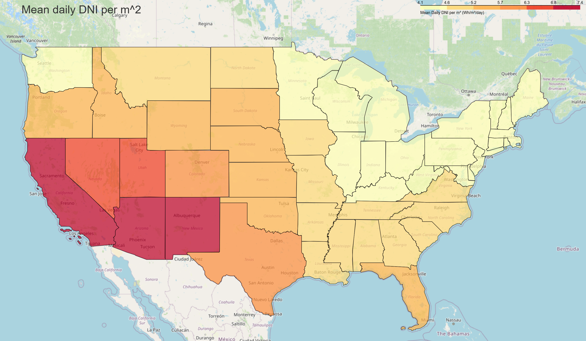
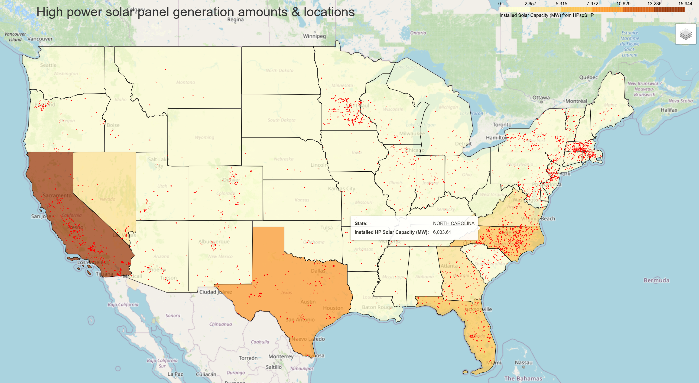
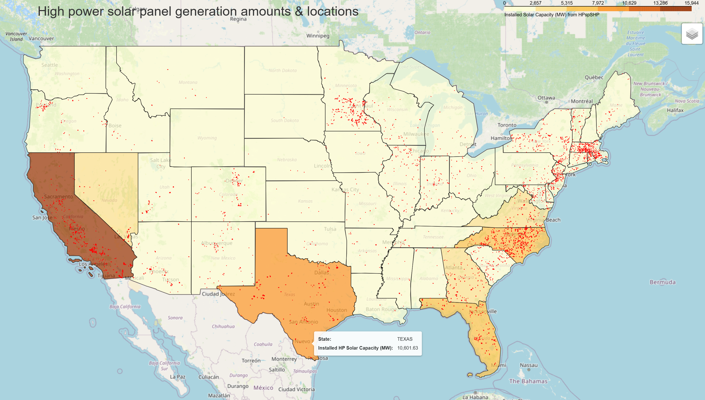
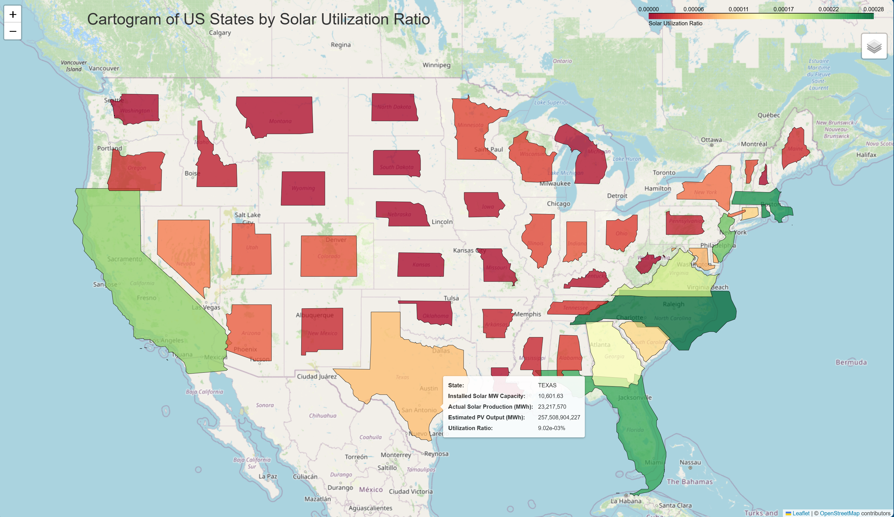
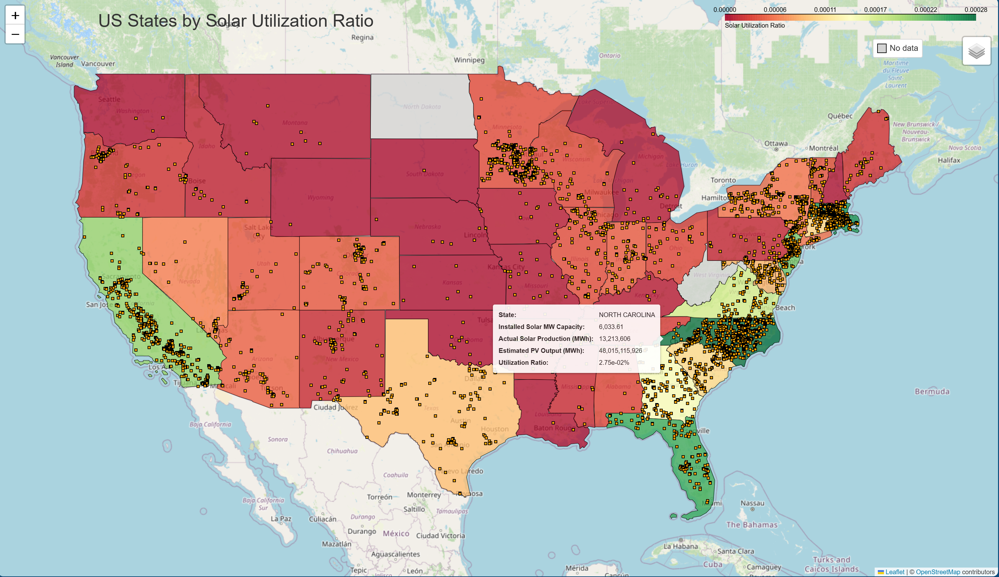
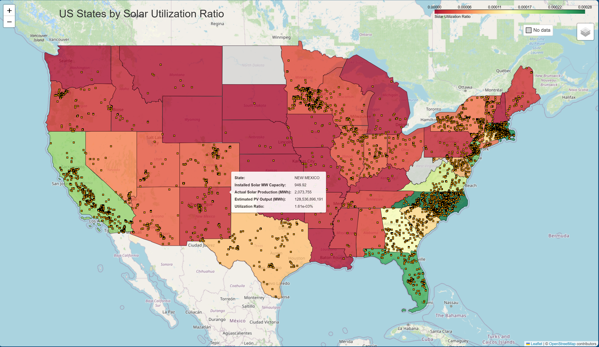
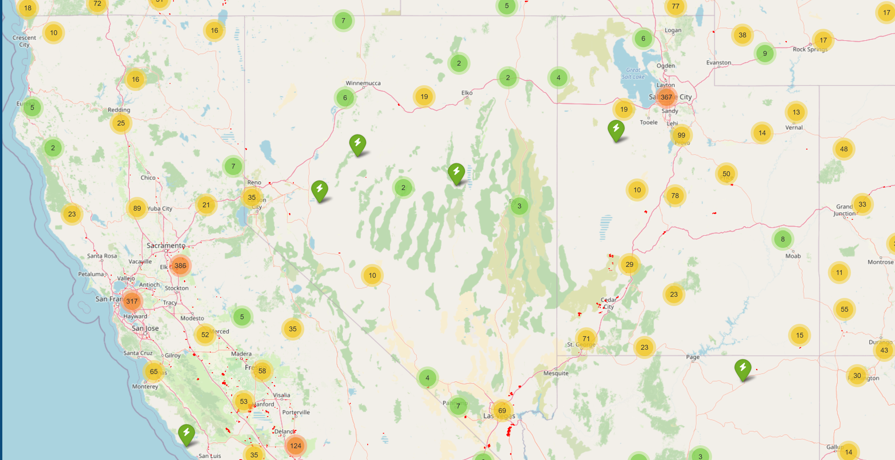
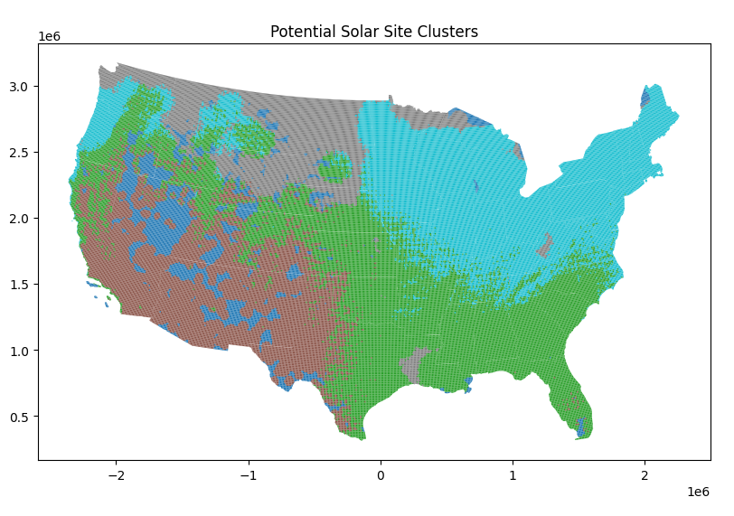

# SolarPanelSites
A python based, GIS data visualization project to investigate ideal solar panel site locations across the U.S.A.

# ☀️ Identifying Optimal Locations for High Powered Solar Panels using GIS & Machine Learning

## 📌 Introduction

As the demand for renewable energy continues to grow, maximizing the efficiency and placement of solar energy infrastructure is more critical than ever. This project uses Geographic Information Systems (GIS), remote sensing data, and machine learning to identify the most promising locations across the United States for high-powered solar panel installation.

---

## 💡 Hypothesis

**Certain areas in the United States have high solar resource potential that is currently underutilized. By analyzing land cover, solar irradiance (GHI/DNI), and proximity to existing infrastructure, we can identify optimal future solar panel sites.**

---

## 🌞 Concept: GHI vs. DNI

${GHI} = \text{DHI} + \text{DNI} \cdot \cos(\theta)$

- **GHI**: Global Horizontal Irradiance – total solar radiation received per unit area on a horizontal surface.  
- **DHI**: Diffuse Horizontal Irradiance – scattered sunlight that reaches the surface from all directions (excluding the direct sun).  
- **DNI**: Direct Normal Irradiance – direct sunlight received per unit area, measured on a surface perpendicular to the sun’s rays.  
- **θ (theta)**: Solar zenith angle – the angle between the sun and the vertical direction.

### Why the Difference Matters
- **PV panels** are typically tilted, so using just horizontal irradiance may not reflect actual power generation.  
- Knowing **both DHI and DNI** enables accurate modeling of solar panel performance and overall solar resource estimation.
- In essence ~> fixed position system = GHI ; dynamic/tracking system = DNI
- Because we are interested in Solar Panel technology, **we focus on GHI in this project.**

**Source**: [Kipp & Zonen](https://www.kippzonen.com/News/408/The-Difference-between-Horizontal-and-Tilted-Global-Solar-Irradiance)

---

## 📊 Datasets Used

| Dataset | Description | Link |
|--------|-------------|------|
| Land Use | Land cover raster dataset (Sentinel-2, 10m resolution) | [Land Use Dataset](https://ic.imagery1.arcgis.com/arcgis/rest/services/Sentinel2_10m_LandCover/ImageServer) |
| Substations | High voltage electric substation locations across the U.S. | [US Substations Dataset](https://543rd-gpc-hub-543rd.hub.arcgis.com/datasets/electric-substations/explore?location=32.356054%2C-98.690977%2C6.41) |
| High Powered Solar Panels | Locations of U.S. solar panels above 1 MW capacity (as of 2022) | [High Powered Solar Panel Dataset](https://energy.usgs.gov/uspvdb/) |
| GHI Raster | Global Horizontal Irradiance raster data (1998–2016 averages) | [GHI Dataset](https://www.nrel.gov/gis/solar-resource-maps) |
| DNI Raster | Direct Normal Irradiance raster data (1998–2016 averages) | [DNI Dataset](https://www.nrel.gov/gis/solar-resource-maps) |
| US Shapefile | U.S. state boundaries shapefile from TIGER/Line (2024) | [US Shapefile](https://www2.census.gov/geo/tiger/TIGER2024/STATE/) |

## 🛠️ Tools and Technologies

- **Python**: Data processing and machine learning (scikit-learn, rasterio, geopandas)
- **ArcGIS Pro**: Raster and spatial analysis
- **QGIS**: Supplementary GIS visualization
- **Matplotlib / Seaborn**: Data visualization
- **NumPy / Pandas**: Data manipulation and aggregation
- **KNN Clustering**: For site selection modeling

---

## 📐 Utilization Ratio

### The Formula

To evaluate how effectively each U.S. state is leveraging its solar potential, we compare the **estimated solar energy output** based on available solar resources (GHI) and land area, with the **actual MWh of solar energy** currently being produced in that state.

---

### ☀️ The Formula

We are interested in comparing **solar irradiation resources** to **actual solar energy production** for each U.S. state. To estimate how much energy could be generated if all solar-eligible land were utilized with photovoltaic panels, we use:

```math
Estimated\ PV\ Output\ (MWh) = GHI_{sum} \times Area_{m^2} \times 365 \times Efficiency \div 1000
```

- `GHI_sum`: The **sum of GHI values** across a state's area in **kWh/m²/day**. This is extracted using zonal statistics from the NSRDB GHI raster.  
  ➤ Raster values represent **daily average solar radiation per square meter**.

- `Areaₘ²`: The **approximate surface area** of each pixel is assumed to be **16,000,000 m²**, based on a 4 km × 4 km pixel resolution in the NSRDB raster.  
  ➤ Total area is computed by multiplying the pixel area by the number of pixels per state.

- `365`: Converts daily irradiance to annual.

- `Efficiency`: Real-world performance factor of **20%** (typical for modern photovoltaic systems, accounting for real-world losses).

- `÷ 1000`: Converts from **kWh to MWh**.

✅ **Final Output Unit**: Megawatt-hours per year (**MWh/year**)

---

### ⚡ Actual Solar Production (MWh)

To estimate real-world annual energy output based on known solar plant capacity, we use:

```math
Actual\ Solar\ Production = Capacity_{MW} \times 8760 \times CapacityFactor
```

- `Capacity_{MW}`: The **total installed solar capacity** in megawatts (MW) from known utility-scale plants.
- `8760`: Total hours in a year (365 × 24).
- `CapacityFactor`: An efficiency modifier to account for clouds, downtime, and other system losses.  
  ➤ A **25% capacity factor** is used, typical for single-axis tracking systems in the U.S.

✅ **Final Output Unit**: Megawatt-hours per year (**MWh/year**)

---

### 🔁 Utilization Ratio

To assess how effectively each state is using its solar potential:

```math
Utilization\ Ratio = \frac{Actual\ Solar\ Production}{Estimated\ PV\ Output}
```

- **> 1.0** → The state may be **importing solar energy** or using its limited solar resource **very efficiently**  
- **≈ 1.0** → The state is **efficiently utilizing** its available solar resource  
- **< 1.0** → The state has **untapped solar potential**

---

### 📝 Notes

- Calculations assume **solar-eligible land** was identified using high-resolution land cover raster data.
- The NSRDB GHI raster data provides **annual average daily GHI values (kWh/m²/day)** at approximately **4 km resolution**.
- Each pixel is assumed to represent **16 million square meters**.
- This methodology is ideal for **energy policy analysis, infrastructure planning**, and **solar equity mapping**.


---

#### 🧠 Why This Matters

This formula-driven framework allows us to:
- Normalize solar performance **across regions** with different geography and solar potential  
- Identify **states with high untapped potential** for investment  
- Create a **cartogram visualization** that highlights overperformers and underutilized regions  
- Provide a **data-backed case** for targeting specific areas for solar infrastructure expansion

This approach transforms raw spatial and energy data into actionable insight.

---

## 🗣️ Narrative

### DNI

Solar Irradiance is the source of energy for PV solar panels. Specifically DNI is our primary consideration as mentioned above (section: 🌞 Concept: GHI vs. DNI). We observe the monthly averages for solar irradiance over the years of 1998-2016. 





### Average Monthly DNI

If we look at the mean of each state annually, we can see the relative intensity is clearly strongest in the states of California, Arizona, and New Mexico.



### PV System generation amounts

In the map below we show the current high powered solar panel sites (1MW<) overlayed on a Choropleth map visualization the total power generation from these sites per state by state.





The highest generators of solar power energy are the states of California, Texas, and North Carolina. Notice how even though North Carolina has many more individual sites, their total power generation is less than Texas. Considering this difference, It may be helpful to consider the potential each state has for solar power generation relative to their DNI intensity versus the actual amount of power generated.

### Utilization Ratio

Regular choropleth maps have some issues with fully representing the geospatial differences between states [as seen here](https://populationeducation.org/limitations-to-choropleth-maps-a-warning-on-misleading-data/). To overcome this shortcoming, we introduce a Cartogram where the both the sizes and colors of the states signify the differences in the utilization ratio of solar resources across US states.



You can see that North Carolina, with its plethora of solar panels and lower DNI intensity had the largest utilization ratio. Meanwhile, New Mexico, despite being one of the states with the highest Mean DNI does not have enough solar panels to capture the available solar power.





By overlaying the current sites we can notice that the amount of solar sites does not correlate to the intensity of solar irradiance. We may take this to mean that political investment and historical decision making have shaped progress regarding high powered solar panel installments. Or, there may also be something else that is impacting the ability to capture and convert solar energy.

### Substations

Let’s look at Nevada, where the utilization is relatively low with many of the solar panels seemingly avoiding most of the northern region.


We may consider the lack of substations, required electrical grid infrastructure components needed to convert DC power in AC, the standard in the electrical grid.



If the United States government were interested in implementing subsidies and grants to aid the renewable energy transition, the states with low utilization rates and ample grid infrastructure could prove transformative for that state's power production, even exporting the excess energy to other states which could improve economic outcomes.

### KNN Results



Then we used KNN clustering to consider all of the previously mentioned factors to look for trends across the US

We notice segmentation across the traditional divides of North East and South East with a bit more granularity in the clusters in the western United States. Investing in the smaller green and light blue clusters in the North West may produce similar outcomes to those in the east. 

Meanwhile, the dark blue clusters are so spread out that they seem to indicate zones to avoid. Most importantly, the brown areas, with high DNI, indicate an environment with great potential for growth.

---

## Conclusion

In conclusion, we find that the South West state of the U.S. would be the best location to install new solar panels. We would recommend further analysis into Land Use patterns, Power Grid capabilities, existing power generation metrics, and the ever changing dynamics of power consumption. We believe that High Powered Solar Panels could prove a valuable asset in the transition to renewable energies, if their installation is planned for and executed efficiently.

---

## Considerations

- A renewable energy transistion must be managed at a local level to ensure that voltage overloading does not occur as this can damage power grid components.
- Per landuse restrictions, such as forest/marshland/mountains, not every location is suitable for solar panel installation.
- Any strategic decision should also concide with cost models such as NREL's [CREST: Cost of Renewable Energy Spreadsheet Tool](https://www.nrel.gov/analysis/crest.html)

---

## 🚀 Future Work

- Incorporate real-time solar irradiance data  
- Improve model accuracy with satellite-based topography (e.g., SRTM)  
- Factor in proximity to energy demand centers
- Create Utilization Cartogram across different months

